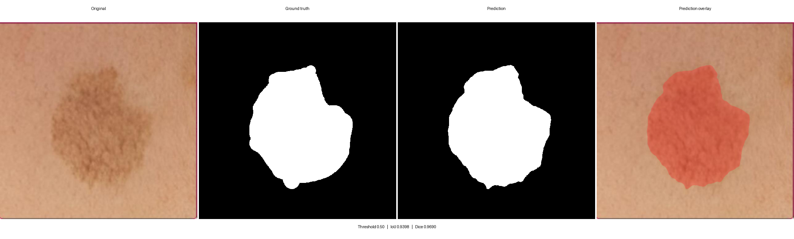
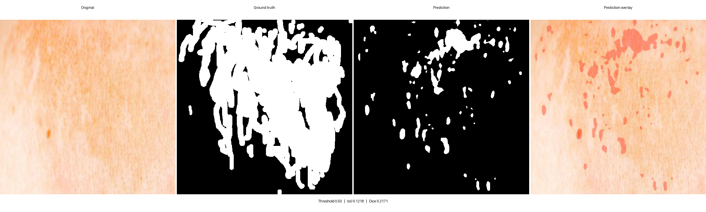

# U-Net Segmentation for Dark Spots and Melasma

A PyTorch U-Net for binary semantic segmentation of visible dark spots and melasma-like pigmentation in facial images.

The project includes pretrained model weights, training and evaluation pipelines, batch inference, qualitative analysis tools, and an optional FastAPI service. Dataset preparation included the manual annotation of more than 5,000 images.

> **Research disclaimer:** This model is intended for computer-vision research and education. It is not a medical device or diagnostic tool. See [MODEL_CARD.md](MODEL_CARD.md) for intended use and limitations.

## Results

Evaluation on a 49-image test set at a probability threshold of 0.5 produced the following results:

| Metric | Result |
| --- | ---: |
| Dice | 0.7286 |
| IoU | 0.5939 |
| Precision | 0.7619 |
| Recall | 0.7525 |
| F1 | 0.7571 |

These results measure segmentation performance on the project test set and do not represent clinical validation. The annotated training data are not distributed with the repository.

## Qualitative examples

### Segmentation example

IoU `0.7468` · Dice `0.8551`



### Challenging example

IoU `0.2717` · Dice `0.4273`

The prediction over-segments fragmented regions and misses portions of the manual annotation.



<sub>Example images: [dark spots — v1_clean_640_dark_spots](https://universe.roboflow.com/aaa-smeo4/dark-spots-g2nd1-mdfgv-tgt7p), [CC BY 4.0](https://creativecommons.org/licenses/by/4.0/). Prediction grids and metrics added for this project.</sub>

## Architecture

The network follows the encoder-decoder U-Net design:

- four downsampling stages with double-convolution blocks;
- four skip-connected upsampling stages;
- bilinear upsampling;
- one output channel for binary segmentation;
- 640 × 640 RGB input;
- 64 base channels.

## Repository contents

| File | Purpose |
| --- | --- |
| `unet_model.py` | U-Net architecture |
| `checkpoint.py` | Safe tensor-only checkpoint loading |
| `predict.py` | Image and directory inference with masks and overlays |
| `dataset.py` | Paired image-mask dataset loader |
| `train.py` | BCE + Dice training pipeline |
| `evaluate.py` | Dice, IoU, precision, recall, and F1 evaluation |
| `rank_examples.py` | Per-image IoU ranking for error analysis |
| `make_example_grid.py` | Four-panel qualitative comparison generator |
| `api.py` | Optional FastAPI prediction service |
| `weights/u-net-dark-spots-melasma.pt` | Pretrained inference checkpoint |

## Installation

Python 3.10 or newer is recommended.

```bash
python -m venv .venv
```

Activate the environment, then install the dependencies:

```bash
pip install -r requirements.txt
```

For a CUDA-specific PyTorch build, use the installation command provided by PyTorch for your operating system and CUDA version.

## Run inference

Process one image:

```bash
python predict.py --input path/to/image.jpg
```

Process all supported images in a directory:

```bash
python predict.py --input path/to/images --output-dir outputs
```

Each input produces a binary mask and a red prediction overlay. Use `--threshold` to change the default probability threshold of 0.5.

## Dataset structure

Training and evaluation expect PNG masks with filenames matching their source image stems:

```text
dataset/
├── images/
│   ├── train/
│   ├── valid/
│   └── test/
└── masks/
    ├── train/
    ├── valid/
    └── test/
```

For example, `images/train/subject_001.jpg` pairs with `masks/train/subject_001.png`.

## Train

```bash
python train.py --data path/to/dataset --epochs 100 --batch-size 4
```

Checkpoints are written to `runs/training` by default. Generated runs and datasets are ignored by Git.

## Evaluate

```bash
python evaluate.py --data path/to/dataset --split test
```

## Optional API

Start the service locally:

```bash
uvicorn api:app --host 127.0.0.1 --port 8000
```

Open `http://127.0.0.1:8000/docs` for interactive API documentation. Uploaded images are processed in memory and are not persisted by the service.

## Pretrained weights

The included checkpoint contains the trained U-Net parameters required for inference. Optimizer state is not included.
